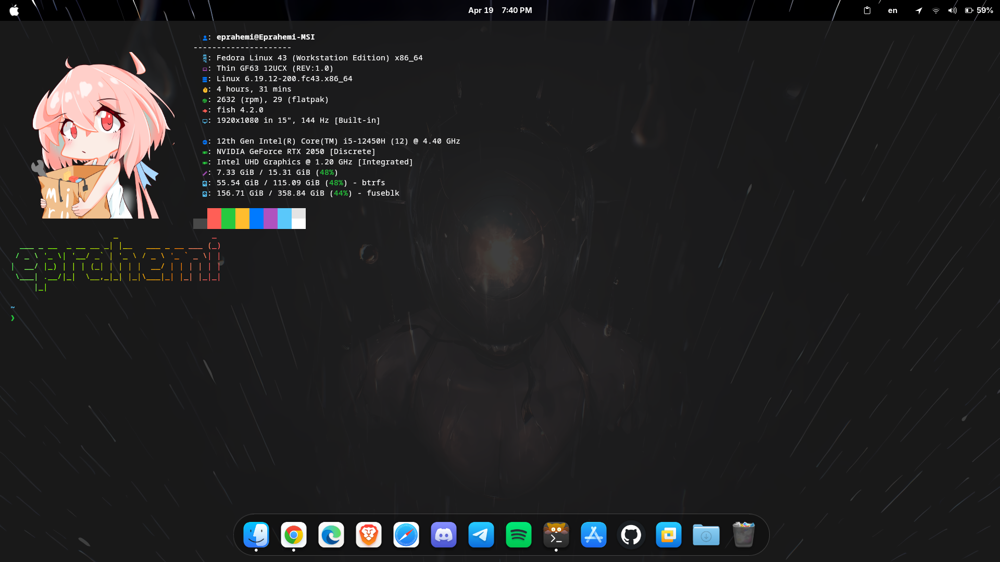
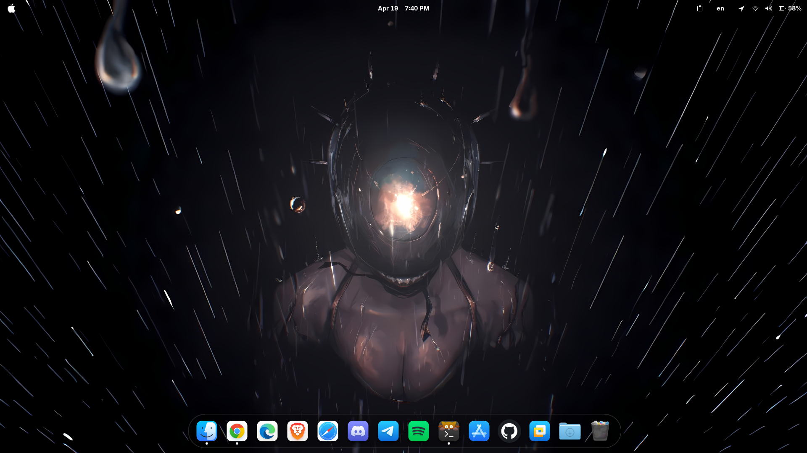

-----------  -----------

# 🌌 Minimalist High-End Terminal Setup

> A beautiful, curated terminal experience featuring **Kitty**, **Fastfetch**, and **Fish Shell**. Designed for GNOME-based Linux distributions but compatible with almost any modern Linux environment.

---

## ✨ Preview

---

## 🚀 Quick Start

Follow these steps to transform your terminal into a high-end workspace.

### 1. Install the Essentials
To get the full look, including the custom ASCII art and the prompt, you need to install the dependencies:

# For Fedora
`sudo dnf install kitty fastfetch fish figlet cmatrix hollywood`

**Important:** This setup uses **Starship** for the prompt. Install it with:
`curl -sS https://starship.rs/install.sh | sh`

### 2\. Set Fish as Default

Switch from the standard Bash to the powerful Fish shell:

`chsh -s $(which fish)`

*(Note: You may need to log out and back in for this to take effect.)*

### 3\. Apply the Configuration

Move my configuration files into your local directory:

1.  Clone this repository.
2.  Navigate to your `~/.config` folder.
3.  Replace the `fish`, `kitty`, and `fastfetch` folders with the ones from this repo.

<!-- end list -->

# Quick command to move them (if you are in the cloned repo folder)

`cp -r fish kitty fastfetch ~/.config/`

-----

## 🛠️ Custom Functions Toolkit

These aren't just aliases; they are full scripts located in the `fish/functions/` folder.

| Command | Action | Why use it? |
| :--- | :--- | :--- |
| **`l`** | Smart List | My high-end replacement for `ls` with icons and details. |
| **`matrix`** | The Matrix | Drops you into the green digital rain effect. |
| **`hollywood`** | Movie Mode | Splits terminal into "hacker" panes for the aesthetic. |
| **`clean`** | Deep Clear | Resets the terminal buffer for a truly fresh start. |
| **`cat`** | Custom Viewer | A customized way to view file contents beautifully. |

-----

## 👤 Personalize Your Name
The terminal greeting shows **"eprahemi"** in rainbow ASCII art. To change this to your own name:

1. Open the configuration file:
   
   `sudo nano ~/.config/fish/functions/fish_greeting.fish`
   
3. Change the word inside the quotes to your name:
   
   # Change "eprahemi" to "yourname"
   function fish_greeting
       figlet "yourname" | lolcat
   end
   
5. Save and restart your terminal!

---

## 📦 Extra Dependencies
For the greeting and effects to work, make sure you have these installed:

# Fedora

`sudo dnf install figlet lolcat cmatrix hollywood`

-----

## ✨ Desktop Aesthetics

## ✨ Preview

  * **GTK Theme:** [MacTahoe](https://github.com/vinceliuice/WhiteSur-gtk-theme)
  * **Icons:** MacTahoe Icons
  * **Wallpaper:** Available in my Wallpapers repository.

-----

**GitHub:** [@xmyhead3](https://www.google.com/search?q=https://github.com/xmyhead3)  
**Discord:** `@7umz`
